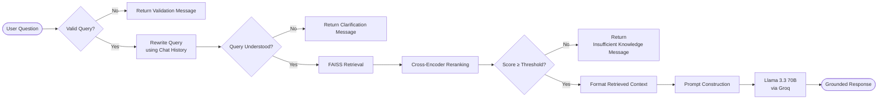

# Introduction

**Medical RAG Assistant** is an end-to-end Retrieval-Augmented Generation (RAG) application that answers general medical questions using a knowledge base built from approximately **1,005 [MedlinePlus Health Topics](https://medlineplus.gov/healthtopics.html)**.

The system implements a complete RAG pipeline, including web scraping, document preprocessing, chunking, embedding generation, FAISS vector search, cross-encoder reranking, and response generation through a Streamlit interface.

Beyond building the application, the retrieval pipeline was systematically evaluated using **Precision@K**, **Recall@K**, **MRR**, and **nDCG**. Multiple retrieval configurations were compared to identify the most effective approach, with **FAISS similarity search combined with Cross-Encoder reranking** selected as the final retrieval pipeline. The project also includes reranker threshold calibration and response faithfulness evaluation.

## Features

- General medical question answering using RAG
- Knowledge base of approximately **1,005 MedlinePlus Health Topics**
- Semantic retrieval with FAISS and Cross-Encoder reranking
- Context-grounded response generation
- Retrieval evaluation with Precision@K, Recall@K, MRR, and nDCG
- Reranker threshold calibration
- Faithfulness evaluation
- Streamlit web interface

## How it Works



## Evaluation

### Benchmark Dataset

A custom benchmark was created to evaluate the retrieval pipeline, as no benchmark was available for this knowledge base.

Approximately **100 questions** were manually written by sampling documents from the **1,005 MedlinePlus Health Topics**. The questions were designed to resemble general user queries and could be answered using one or more relevant documents.

To build the ground truth, a **pooling** approach was used. Multiple retrieval configurations were run for each question, and all retrieved documents were combined into a candidate pool. An LLM then labeled each pooled document for relevance, while the labels were continuously reviewed and corrected manually whenever necessary.

Although the benchmark is relatively small, it provides a consistent and practical dataset for comparing retrieval configurations and evaluating retrieval quality.

### Retrieval Experiments

Multiple retrieval configurations were evaluated to identify the best-performing retrieval pipeline for the MedlinePlus knowledge base.

The experiments compared:

* **Search strategies:** Similarity Search and Maximal Marginal Relevance (MMR)
* **Retrieval configurations:** Pure FAISS retrieval and hybrid retrieval using different FAISS/BM25 weight combinations

Each configuration was evaluated on the benchmark dataset using **Recall@5**, **Recall@10**, **Precision@5**, **Precision@10**, **MRR**, **nDCG@5**, and **nDCG@10**.

The results showed that **FAISS Similarity Search (FAISS: 1.0, BM25: 0.0)** consistently achieved the best overall performance. Although hybrid retrieval was also evaluated, it did not outperform pure FAISS retrieval for this knowledge base and was therefore not selected for the final system.

**References**

* **Experiment implementation:** `Eval/retriever_experiments.py`
* **Complete experimental results:** `Eval/results/experiment.csv`

### Cross-Encoder Reranker Evaluation

The Cross-Encoder reranker was evaluated to determine its impact on retrieval performance and context selection.

The experiments compared retrieval with and without reranking using different values of **retrieve_k** and **rerank_k**. Each configuration was evaluated on the benchmark dataset using **Recall@K**, **Precision@K**, **MRR**, and **nDCG**.

The results showed that reranking did not significantly improve retrieval metrics compared to baseline FAISS retrieval. However, it reduced the number of documents passed to the LLM by selecting the highest-scoring chunks, improving context efficiency.
Based on these experiments, the final system uses **retrieve_k = 10** and **rerank_k = 5**.

**References**

* **Experiment implementation:** `Eval/reranker_experiments.py`
* **Complete experimental results:** `Eval/results/reranker_experiments.csv`

### Reranker Threshold Calibration

A reranker score threshold was calibrated to determine when the assistant should answer a question and when it should refuse due to insufficient relevant context.

A calibration dataset of **150 questions** was created:

* **50** medical questions covered by the knowledge base
* **50** medical questions not covered by the knowledge base
* **50** non-medical questions

The questions were created manually, with limited assistance from an LLM. Each question was passed through the final retrieval pipeline (**FAISS Similarity Search + Cross-Encoder Reranker**), and the highest reranker score was recorded.

The recorded scores were analyzed to select an appropriate threshold. The selected threshold was then evaluated on the calibration dataset to measure acceptance and rejection behavior across different query categories.

**References**

| File | Description |
|------|-------------|
| `Eval/data/calibration_questions.json` | Calibration dataset containing 150 evaluation questions. |
| `Eval/calibrate.py` | Records the highest reranker score for each calibration question. |
| `Eval/summarize_calibration.py` | Computes statistical summaries of the recorded reranker scores to assist in selecting an appropriate threshold. |
| `Eval/threshold_eval.py` | Evaluates the selected threshold by measuring acceptance and rejection rates across the three question categories. |
| `Eval/results/threshold_calibration.csv` | Highest reranker score recorded for every calibration question. |
| `Eval/results/summary_calibration.csv` | Statistical summary (minimum, quartiles, median, mean, maximum, and standard deviation) of reranker scores for each question category. |
| `Eval/results/threshold_summary.csv` | Final acceptance and rejection results after applying the selected threshold. |

### Faithfulness Evaluation

The final system was evaluated for **faithfulness** to verify that generated responses were grounded in the retrieved context.

A set of **50 medical questions** was evaluated using an LLM-based judge with both **top-3** and **top-5** retrieved documents as context.

The **top-3** configuration achieved slightly higher faithfulness scores. However, the difference was small, so **top-5** was selected as the final configuration to provide the language model with more relevant context for answering broader or more detailed questions.

A faithfulness score of **0** indicates that the assistant did not generate a response because the reranker score was below the calibrated threshold.

**References**

| File | Description |
|------|-------------|
| `Eval/ragas_eval_results.py` | Runs the RAG pipeline for the evaluation dataset and saves the generated answers with their retrieved contexts. |
| `Eval/ragas_score.py` | Evaluates the generated responses using the Ragas faithfulness metric. |
| `Eval/results/ragas_medical_scores_top3.csv` | Faithfulness scores using the top-3 retrieved documents. |
| `Eval/results/ragas_medical_scores_top5.csv` | Faithfulness scores using the top-5 retrieved documents. |

### Limitations

- The current knowledge base focuses mainly on disease information, symptoms, treatments, and wellness topics from MedlinePlus. It does not include detailed medication information such as dosage, drug interactions, timing, or supplement guidance. Expanding the knowledge base with drug and supplement resources would be required for those types of queries.

- The Cross-Encoder reranker improves context selection but introduces additional computation and latency compared to retrieval-only approaches.

- The evaluation benchmark was manually created for this project and is relatively small. It is useful for comparing retrieval configurations within this system, but it may not fully represent the diversity of real-world medical queries.

## Project Structure

```text
Medical-RAG-Assistant/
│
├── app.py                      # Streamlit application
├── chatbot.py                  # Main RAG pipeline
├── retriever.py                # FAISS retrieval
├── reranker.py                 # Cross-Encoder reranking
├── ingest.py                   # Builds the vector database
├── llm.py                      # LLM initialization
├── prompts.py                  # Prompt templates
├── formatter.py                # Context formatting
├── config.py                   # Project configuration
│
├── data/
│   ├── scraped_data/           # 1,005 MedlinePlus Health Topic markdown files
│   └── topics.json             # Scraped topic metadata
│
├── vectorstore/
│   ├── faiss_index/            # Pre-built FAISS vector index
│   └── chunks.pkl              # Stored chunk metadata
│
├── Web_scraping/
│   ├── scraper.py              # Main web scraping pipeline
│   ├── get_topics.py           # Collects MedlinePlus Health Topics
│   └── get_categories.py       # Collects topic categories
│
├── Eval/
│   ├── data/                   # Benchmark, calibration, and RAGAS datasets
│   ├── results/                # Evaluation results and detailed evaluation report
│   ├── evaluate.py             # Computes retrieval metrics (Recall, Precision, MRR, nDCG)
│   ├── pooling.py              # Pooling for ground-truth creation
│   ├── label_chunks.py         # LLM-based relevance labeling
│   ├── retriever_experiments.py # Compares retriever configurations using evaluation metrics
│   ├── reranker_experiments.py # Evaluates reranker configurations
│   ├── calibrate.py            # Collects reranker scores for threshold calibration
│   ├── threshold_eval.py       # Evaluates reranker threshold acceptance and rejection performance
│   ├── ragas_eval_results.py   # Generates responses for faithfulness evaluation
│   └── ragas_score.py          # Computes RAGAS faithfulness scores
|   └── summarize_calibration.py # Computes statistical summaries of the recorded reranker scores
│
├── utils/
│   └── logger.py               # Configures application logging and suppresses unnecessary library logs
│
├── requirements.txt
└── README.md
```

### Evaluation Assets

**Eval/data**

- `benchmark.json` – Benchmark questions
- `pool.json` – Pooled retrieval results
- `ground_truth.json` – Final labeled ground truth
- `calibration_questions.json` – Threshold calibration dataset
- `ragas_eval.json` – Faithfulness evaluation dataset
- `ragas_evaluation_results_top3.json` – Generated responses (Top-3)
- `ragas_evaluation_results_top5.json` – Generated responses (Top-5)

**Eval/results**

- `experiment.csv` – Retriever experiment results
- `reranker_experiments.csv` – Reranker experiment results
- `threshold_calibration.csv` – Recorded reranker scores
- `summary_calibration.csv` – Statistical summary of reranker scores
- `threshold_summary.csv` – Threshold acceptance/rejection statistics
- `ragas_medical_scores_top3.csv` – Faithfulness scores (Top-3)
- `ragas_medical_scores_top5.csv` – Faithfulness scores (Top-5)
- `evaluation_report.md` – Detailed evaluation methodology and results

## Installation

Clone the repository:

```bash
git clone https://github.com/ramanpreetx/medical-rag-assistant.git
cd Medical-RAG-Assistant
```

Create and activate a virtual environment:

Windows:

```bash
python -m venv venv
venv\Scripts\activate
```

Install dependencies:

```bash
pip install -r requirements.txt
```

Create a `.env` file in the project root and add your API key:

```env
GROQ_API_KEY=your_api_key_here
```

Run the application:

```bash
streamlit run app.py
```
